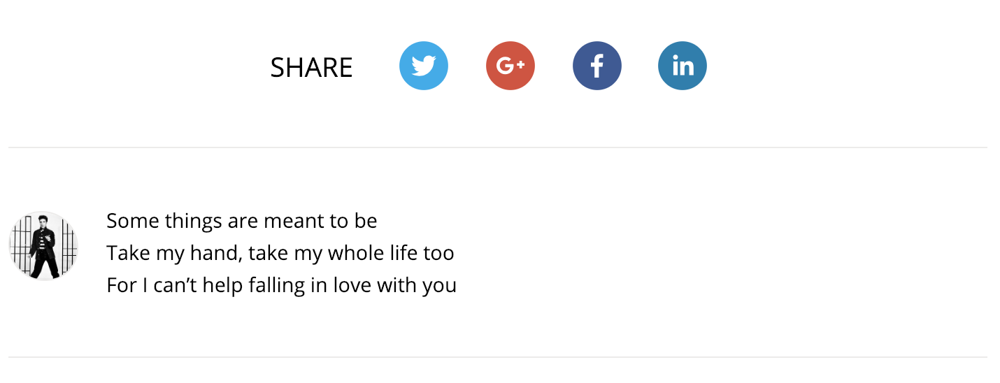

If one of many templates to choose from is good enough for you – way to go!

Otherwise, it takes some deeper knowledge in JavaScript, Gatsby internals, React and a
bit of GraphQL for customizing the functionality.

I will describe the changes we made in a bit of detail.

<!-- end -->

## Bootstrapping and customizing

This blog was based on [HeroBlog](https://github.com/greglobinski/gatsby-starter-hero-blog) Gatsby starter.

It provides a nice design, quite a few features, including our needed features –  a blog with several static pages in the menu.

If the template has all features you need, it's usually enough to customize some JSON files, find and replace
some texts in the templates (no extra knowledge is needed) and provide content in markdown.

In cases where you want to extend the functionality, you'll need to change the React components (templates), tweak
GraphQL queries for data extraction and possibly write some code for Node to propagate that data.

Basically, Gatsby works as follows:
- you have your data model. It's usually propagated by standard plugins and static files, but you can also
change the data propagation behavior in `gatsby-node.js`. Plugin configuration, like where to look for static files,
is located in `gatsby-config.js`. For example, your markdown files in the repository, using
plugins, become part of your data model;
- in your pages, GraphQL queries are provided to select appropriate fields from your data model;
- this data is passed to React components, which render the pages.

It's quite straight-forward when you get the hand of it, but it might take some time to get used to GraphQL
and React, if you haven't yet.

## What we've changed

We've made several different types of changes:
- customizing the template and configuration;
- installing plugins;
- extending available data structures and adding new features – custom author for each post and multiple tag support;
- adding script for workflow customization – cross posting to Medium.

## Installing plugins

Gatsby has quite a lot [plugins to choose from](https://www.gatsbyjs.org/plugins/).

Many of them will probably be pre-installed by your chosen starting template – in our case,
there were 24 of them.

Using plugins, you can add transformers (different format support as your data),
extend functionality with search, analytics and other tools, add elements with a functionality
like pagination and similar.

We've additionally installed
[gatsby-remark-reading-time](https://www.gatsbyjs.org/packages/gatsby-remark-reading-time/)
and included estimated time to read the blog post.

You can check this out in
[the commit that added this feature](https://github.com/paysera/app-engineering-blog/commit/bea65a9e85f5da23716b77e05c71088c77f8f9d8).

## Adding author support for blog posts

Default templates usually place one pre-configured author everywhere. For our use-case,
we need to easily customize the author for each post.

Intended behavior:
1. We put each author's information in separate markdown document:
```x
content
└── authors
    └── j.cash.md
    └── e.presley.md
```

2. We include basic information in the *frontmatter* and author's description in the body:

```x
---
avatar: https://upload.wikimedia.org/wikipedia/commons/thumb/9/99/Elvis_Presley_promoting_Jailhouse_Rock.jpg/440px-Elvis_Presley_promoting_Jailhouse_Rock.jpg
name: Elvis Presley
---

Some things are meant to be

Take my hand, take my whole life too

For I can't help falling in love with you
```

3. In the post itself, we only provide the username of the author in the *frontmatter*:

```x
---
title: Blog title
cover: cover.png
author: e.presley
---

Blog post contents
```

We expect the following result in the suffix of the post:



In the post list and post header we also expect to see the name of the author, `Elvis Presley` in this case.

### Making this happen

First of all, we need to make Gatsby read the contents of `authors/` folder. This is done by adding a new plugin
configuration in `gatsby-config.js`:

```js
    {
        resolve: 'gatsby-source-filesystem',
        options: {
            name: 'authors',
            path: `${__dirname}/content/authors/`
        }
    },
```

In this case, it was important to add this before `/content/posts/` folder configuration – we make an assumption later on
that we get authors before the posts. This allows to fill in the author data in the posts within a single loop.

This change would already allow us to get all available authors in our pages using GraphQL. In this case, we also
need the username, which is in the filename, and to add the author data to the posts themselves for easier manipulation
later on. To populate this data, changes to the `gatsby-node.js` are needed:

```js
// ...
const users = {};
exports.onCreateNode = ({ node, getNode, actions }) => {
    const { createNodeField } = actions;
    if (node.internal.type !== 'MarkdownRemark') {
        return;
    }
    
    const slug = createFilePath({ node, getNode });
    const fileNode = getNode(node.parent);
    const source = fileNode.sourceInstanceName;

    if (source === 'authors') {
        // add `username` field with filename (trim `/` from left and right)
        const username = slug.replace(/^\/|\/$/g, '');
        createNodeField({
            node,
            name: 'username',
            value: username
        });
        users[username] = node;
    }
    // ...
    if (node.frontmatter && node.frontmatter.author) {
        // for posts, add `author` field with the data
        createNodeField({
            node,
            name: 'author',
            value: users[node.frontmatter.author]
        });
    }
    // ...
};
```

We can restart `npm run develop` process and take a look at `/___graphql` if the data is propagated correctly:

```graphql
query {
    authors: allMarkdownRemark(filter: {fields: {source: {eq: "authors"}}}) {
        edges {
            node {
                html
                fields {
                    username
                }
                frontmatter {
                    avatar
                    name
                }
            }
        }
    }
    post: markdownRemark(fields: {source: {eq: "posts"}}) {
        fields {
            author {
                frontmatter {
                    name
                }
            }
        }
    }
}
```

We see the expected result:

```json
{
    "data": {
        "authors": {
            "edges": [
                {
                    "node": {
                        "html": "<p>Something about Johnny</p>",
                        "fields": {
                            "username": "j.cash"
                        },
                        "frontmatter": {
                            "avatar": "https://johnny.com/avatar.png",
                            "name": "Johnny Cash"
                        }
                    }
                },
                {
                    "node": {
                        "html": "<p>Some things are meant to be</p>...",
                        "fields": {
                            "username": "e.presley"
                        },
                        "frontmatter": {
                            "avatar": "https://upload.wikimedia.org/...Jailhouse_Rock.jpg",
                            "name": "Elvis Presley"
                        }
                    }
                }
            ]
        },
        "post": {
            "fields": {
                "author": {
                    "frontmatter": {
                        "name": "Elvis Presley"
                    }
                }
            }
        }
    }
}
```

Unfortunately, adding `author` as a field does not populate `html` property – it's populated only for root
elements when using `markdownRemark` and similar queries.

To get the description, we have to query all the authors in each post and filter them out manually by current context.
In PostTemplate.js:

```js
export const postQuery = graphql`
    query PostBySlug($slug: String!) {
        post: ...
        authors: allMarkdownRemark(filter: {fields: {source: {eq: "authors"}}}) {
            edges {
                node {
                    html
                    frontmatter {
                        name
                        avatar
                    }
                    fields {
                        username
                    }
                }
            }
        }
    }
`;

const { data: { authors, post } } = props;
const authorNode = authors.edges.find(a => a.node.fields.username === post.frontmatter.author);
const author = authorNode ? authorNode.node : undefined;

// use author – pass to components where needed   
```

If we just need the author's name, we don't have to query it manually – it's available
inside `post.fields.author.frontmatter.name`.

What's left is just to display the data inside the components where needed.

You can see all the needed changes for this feature in
[this commit](https://github.com/paysera/app-engineering-blog/commit/fd8ece6a408ec5050597cc4f388237cc3131e425).

## Adding support for many tags for each post

Originally, the starter only supported a single category for each post. We've added multiple tag support to each post to
have a bit more dynamic approach.

Tag feature consists of the following parts:
- tags for each post are defined in the *frontmatter*;
- tags are displayed with each post with a link to all posts with the same tag;
- there's a page with all available tags;
- each tag has it's own page with all posts tagged with it.

When adding array elements in the *frontmatter*, you need to remember that it's actually YAML in that place.
So, you can define them in any of the following ways:
```yaml
---
tags: ["something", "something else"]   # JSON-style
---
```

```yaml
---
tags: [something, something else]       # inlined
---
```

```yaml
---
tags:                                   # split into several lines
    - something
    - something else
---
```

This, on the other hand, would not work:
```yaml
---
tags: something, something else
---
```
It would be treated as a string `"something, something else"`.

Making tags displayed with the post was quite straightforward at this point – we extend GraphQL query to include
new field inside *frontmatter* and pass it down to the components.

Adding a page (for list of tags) is done by creating `.js` file inside `pages/` folder. It was based on previously
available category page, otherwise you'd need to write GraphQL query for extracting data
and React component which receives that data as a property.

Adding specific pages dynamically (for each tag) is done in `gatsby-node.js` file (just like modifying our data for
custom author support):

```js
exports.createPages = ({graphql, actions}) => {
    const {createPage} = actions;

    return new Promise((resolve, reject) => {
        const tagTemplate = path.resolve("./src/templates/TagTemplate.js");

        resolve(
            graphql(`
                {
                    allMarkdownRemark {
                        edges {
                            node {
                                frontmatter {
                                    tags
                                }
                            }
                        }
                    }
                }
            `).then(result => {
                const items = result.data.allMarkdownRemark.edges;

                // Needed as tags are repeated, but we should create page once
                const tagSet = new Set();
                items.forEach(edge => {
                    const {
                        node: {
                            frontmatter: { tags }
                        }
                    } = edge;

                    (tags || []).forEach(tag => tagSet.add(tag));
                });

                // Create tag pages
                tagSet.forEach(tag => {
                    createPage({
                        path: `/tag/${_.kebabCase(tag)}/`,
                        component: tagTemplate,
                        context: {
                            tag
                        }
                    });
                });
            })
        );
    });
};
```

The page logic itself resides in `TagTemplate.js`, which is again a GraphQL query with a React component.

The context which is passed when creating page is available both as `pageContext` property and as parameters in GraphQL
query:
```js
export const tagQuery = graphql`
    query PostsByTag($tag: String) {
        allMarkdownRemark(
            filter: { frontmatter: { tags: { eq: $tag } } }
        ) {
            edges {
                node {
                    fields {
                        slug
                    }
                    frontmatter {
                        title
                    }
                }
            }
        }
    }
`;
```

As you can notice, we can use `$tag` parameter to filter our data – it's because we pass `tag` in the context when
creating a page.

You can see all the needed changes for this feature in
[this commit](https://github.com/paysera/app-engineering-blog/commit/4ca375ca213022a172bd03b65ee6ee3349167995).

### Cross-posting to Medium

To cross-post to Medium we've integrated script from 
[Christoph Michel blog post](https://cmichel.io/how-to-crosspost-to-medium/).

Some modifications & differences:
- we've created a Publication in Medium as we have different authors in our blog;
- we don't have `slug` or `medium` fields in *frontmatter* – we use `tags` and build a slug from the title;
