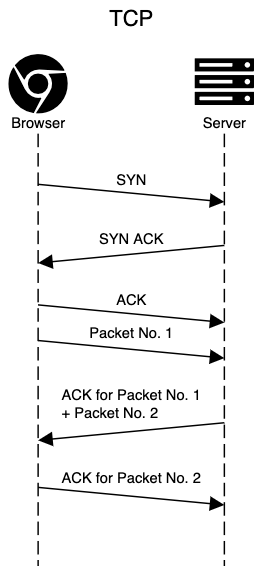
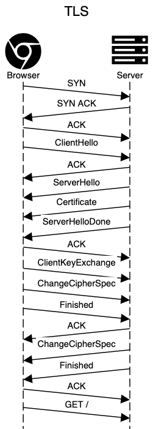
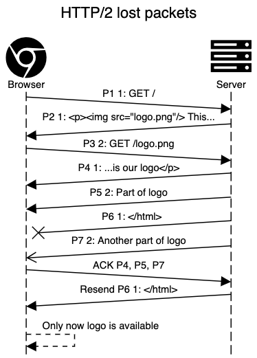

HTTP/1.0 was published in 1996, followed by HTTP/1.1 one year later.

For 18 whole years, this was the standard used for practically the whole web throughout the world,
improving performance with various hacks such as asset bundling, CSS sprites, icon fonts,
and so on.

Then came HTTP/2.

And now, only a few years later, even when
[HTTP/2 adoption has not reached 50% yet](https://w3techs.com/technologies/details/ce-http2/all/all),
HTTP/3 will shortly be introduced.

<!-- end -->

## Why the new versions? Performance, of course! :zap:

Most of the changes introduced right from version 1.0 were oriented towards performance.

To understand what exactly affect performance and how the new versions improve on older ones, we need
to dig a bit deeper into the network stack.

## TCP/IP stack

There are two network layering models – the OSI model and TCP/IP stack. The latter is a bit simpler, so let's
stick to that. It has the following 4 layers:
- Application. Developers are usually interested only in this layer. In our case, this is HTTP.
- Transport. Usually it's TCP or UDP. That's where all the magic happens with HTTP/3, but more on that later.
- Internet. Usually IPv4 or IPv6.
- Link. This usually routes messages using MAC addresses and handles various transport based on
your Internet connection (like Ethernet, WiFi, 4G, etc.).


<!-- https://en.wikipedia.org/wiki/Internet_protocol_suite#/media/File:IP_stack_connections.svg -->

Each layer also adds some type of encapsulation to handle specific routing protocols.


<!-- https://en.wikipedia.org/wiki/Internet_protocol_suite#/media/File:UDP_encapsulation.svg -->

We web developers usually don't even think about what's going on underneath our Application protocol.
We send the message and get some kind of response back. It just works!

At the lowest levels, though, machines work in a "send and forget" mode. It's just the nature of
the links – we broadcast a signal via the wire or some remote signals, and we have no way to know if it
reached the recipient. That is, unless the recipient sends some signal back to us.

This means that packets can get lost for quite many different reasons:
- the unreliable nature of the connection. For example, interference in your WiFi signal;
- over-utilised devices. Routers, switches, and operating systems have buffers for queueing packets
to be transmitted. If they overflow, packets get dropped. This way devices resume to normal operation
right after the peak is gone;
- very similarly – link congestion.

To have a better abstraction (upon which we usually rely), TCP is used in the transport layer.

### TCP

TCP adds the following features to our connection:
- :one::three::two: ordered data transfer – we get the data in the same order we sent;
- :one::boom::three: retransmission of lost packets– we get all the data we sent;
- :one::bug::three: error-free data transfer – if any bit was misinterpreted during the transfer, the packet gets retransmitted;
- flow control and congestion control – the ability to control the rate of transmission.

For this to work, TCP has stateful connections, which get opened and closed. Every packet sent also
gets acknowledged by the receiver.

<!-- https://sequencediagram.org/index.html?presentationMode=readOnly#initialData=C4S2BsFMAIBUGEAKAoZAzA9gO2AQwO6QDOGAtjGgEwBsAHNAEIBOG+RkT62ehJ50VAMyDoAZQ4A3Dqmat2TALQA+ABQBGAJTimUpgC5RATQByyWWw7qNAHgXbdBk9ACC8ANJmWFxas32Oeq4eRAAOuADGMAqCnnIcylb++ogRANaQwNDGGAB00Gqx3la2SYHuAhhM0Cnh6ZnZeQWhEVEx5vLFdpIBNXVZudCUhfIJft36QRVVvRn9eZRAA -->



What should also be noted is that the TCP congestion control mechanism includes a concept called slow-start.
This means that in the beginning of the TCP connection, we can send up to 10 TCP packets, which usually
amount up to 15 KB. Only after receiving 10 ACK can we send another 20 packets, and so on.

### UDP

UDP is an alternative to TCP, which has practically nothing added on top of the Internet layer. No session initiation,
no guarantees over delivery, no mechanisms for flow control.

The UDP header consists of the following fields:
- source port, which is optional;
- destination port;
- length;
- checksum, which is also optional.


## TLS – security layer over HTTP

TLS nowadays is an inseparable part of HTTP. You can get certificates for free, and if you don't use
TLS you get all those :warning: **Insecure!** warnings.

This is even the case with HTTP/3, in which TLS is mandatory. So let's look at how it works, again, from the network
perspective.



TLS has a few options to make fewer round-trips – False Start and Session Resumption.

False Start does not affect the protocol or any data sent, only the timing itself – the client
sends Application data as soon as it gets all data needed for calculating the encryption key.
Unfortunately, some servers are poorly implemented and break when this is enabled. To tackle
this issue, browsers use different strategies, but basically you need to use ALPN and choose
cipher suite, enabling forward secrecy for False Start to work with your server.

Session Resumption uses session IDs to reuse previously exchanged parameters between the browser
and the server.

## HTTP/1.0 vs HTTP/1.1 – keep-alive connections

What was added to HTTP/1.1, in terms of network, was keep-alive connections.

Let's take a look at how this affects a real-world scenario.


The average number of resources loaded by a single web page is
[around 70](https://httparchive.org/reports/state-of-the-web), so the whole initialisation for HTTP/1.0
would add-up quite a bit.

Note: Even for HTTP/1.1, make sure you've enabled keep-alive connections in your server.

Unfortunately, this has a particular flaw – you must wait for a full response to send a new request.
This means that we need to choose between waiting for responses to send new requests or initialising
new connections, which come at a cost, as you've just seen.

This exact problem was tackled with HTTP/2.

## HTTP/1.1 vs HTTP/2 – single TCP connection

To both avoid TCP and TLS initialisations **and** to allow concurrent requests to be sent, HTTP/2 introduced
"streams". It uses a single TCP connection but brings abstraction on top, which allows to
send requests and receive responses (among other things, like server push) over the same connection.

This is how it would look on the network level:


Unfortunately, this doesn't work that well with all those nice TCP features when we get packet losses.
TCP guarantees in-order delivery of every byte sent. This means that if at least one packet is lost,
the whole TCP connection will hang until those get retransmitted.

In HTTP/2 abstraction this is unintended behavior, as packet loss usually affects only one request/response
among many we receive in the same connection.

With unreliable connections, it might even mean that you can get better performance
with HTTP/1.1 than with HTTP/2.

## HTTP/3 vs HTTP/2 – let's drop TCP altogether!

To tackle those problems, a new transport protocol – **QUIC** – was created. It works over UDP and basically
re-implements all the features provided by TCP on top of it.

What's different from TCP is that QUIC supports streams – exactly what's needed for HTTP/3 concurrent
requests and responses. Streams are delivered in-order and they are reliable,
but different streams may be delivered out-of-order.

It also has some other nice features:
- Connection ID, which allows you to resume your download even when your network connection
(and IP) has changed;
- QUIC always uses TLS 1.3 :lock:. No other options of TLS, no option to send plain text;
- as TLS 1.3 is used, data could be sent right after the first round-trip or even with the first packet if
a cached secret exists from a previously established connection.

To see the impact on the network level, this shows a situation where this would matter with HTTP/2:



With QUIC, the logo could be displayed as soon as it's received – streams (separate responses) don't block
each other.

The HTTP/3 protocol itself is practically just a re-definition of HTTP/2 using QUIC streams for transport.
It has a few other differences which are mostly just implementation details.

## Discovering an HTTP/3 Endpoint

As HTTP/3 uses UDP instead of TCP, a browser cannot just negotiate the protocol after the connection is made
to the server.

This means that our HTTP/2 or HTTP/1.1 server must provide the data about our server's HTTP/3 availability.

For this, the `Alt-svc:` HTTP response header or `ALT-SVC` HTTP/2 response frame is used with the protocol, port,
and optional host provided:

```x
Alt-Svc: h3-23=":443"; ma=86400
```

In this example, the server tells you that on the same host, 443 port (using UDP protocol), you can find
draft 23 of the HTTP/3 protocol available. Also, forget this information after 24 hours.

## QUIC gotchas

Unfortunately, there are some issues that are still to be solved to successfully use the UDP protocol for
such functionality:
- UDP is slow. Wait, what?! What I mean is, it makes things quicker in theory and – in most cases – in terms
of network. But in kernels, UDP eats CPU for breakfast and is relatively slow. Well, at least compared to TCP.
This could be due to a lack of interest from developers, so we can hope that it will improve;
- as UDP is used in DOS attacks, many enterprises block UDP traffic on non-53 port (which is used for DNS).
To make matters even worse, some of them throttle UDP packets, making QUIC slower than TCP;
- QUIC does not completely use TLS1.3, it reuses its parts. This means that most crypto libs did not have
the needed interfaces. This could potentially mean dependency hell, as any QUIC client or server would
either require the newest crypto lib or should bring one included with the application.


## Testing and deploying

At this moment, there aren't any official releases, neither for popular servers nor client software.

This is quite natural, as HTTP/3 is itself still a draft – it could change a bit until fully confirmed.

CloudFlare, on the other hand, allows to turn on HTTP/3 (its draft version) with a simple toggle, even when
using free plans.

They also
[provide instructions](https://blog.cloudflare.com/http3-the-past-present-and-future/#http-3-powered-by-a-delicious-quiche)
for compiling cURL and nginx with QUIC support, if you're really eager to try it out yourself.

## A note on how protocols are born nowadays

Google. This company has reached a state where they:
- have the most visited servers in the world;
- develop the most popular browser in the world;
- have enough development resources;
- have a scale where it's worth changing the world to improve performance at least a tiny bit for each user.
Well, their users add up to quite big gains.

In fact, the QUIC protocol was not just thought of and implemented by Google, it was already used
by 7% of internet traffic in 2017. Afterwards, in 2018, Google presented the protocol
to IETF for standardisation. In other words, you're already using almost-HTTP/3
every day for years now.

Very similarly HTTP/2 was born out of another Google protocol – SPDY.

Such a situation could scare a bit, but it also makes for a really big sandbox for Google to test, iterate and improve
on such widely used protocols. Otherwise, it would be much more difficult to include many parties, test,
gather all the information, and agree on improvement strategies. Thanks, Google!

## Further references

If you want to get into more details about HTTP/3, I highly recommend
[HTTP/3 explained](https://http3-explained.haxx.se/en/).

To dig deep into the network layer and performance optimisation – don't miss
[High Performance Browser Networking](https://hpbn.co/).

You can find all drafts of the protocol on the official [QUIC working group page](https://quicwg.org/).
